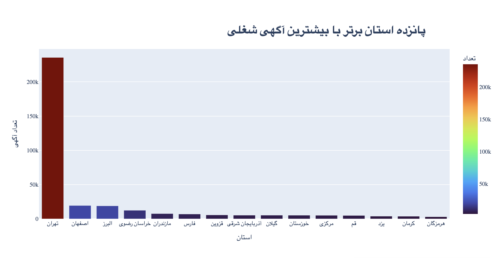
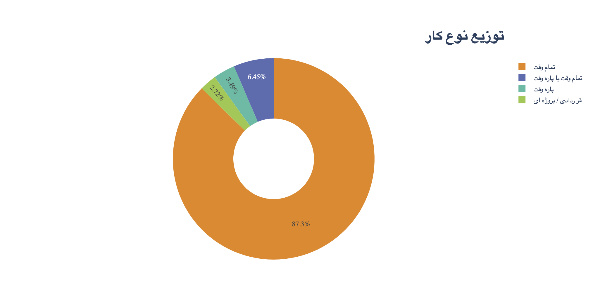
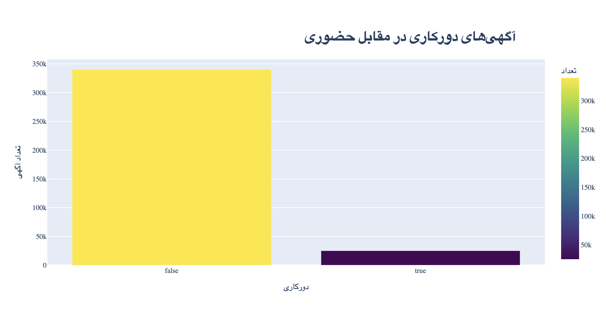
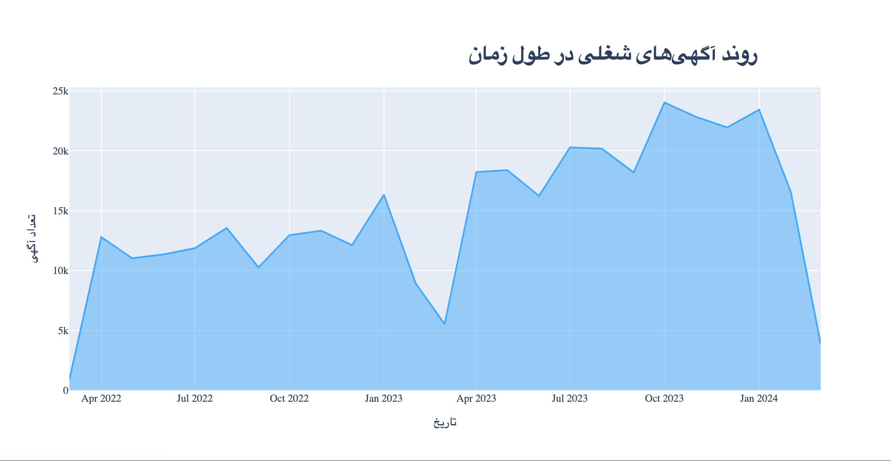
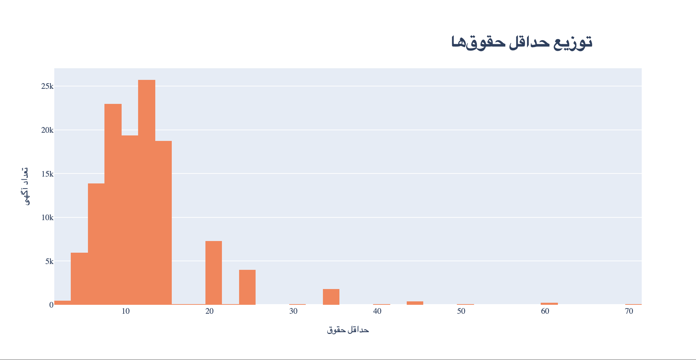

# JobVision-Job-Analysis
# تحلیل جامع بازار کار ایران با داده‌های JobVision

این پروژه به تحلیل داده‌های آگهی‌های شغلی منتشر شده در پلتفرم **JobVision** می‌پردازد و هدف آن ارائه یک تصویر جامع از وضعیت بازار کار، فرصت‌های شغلی، مهارت‌های پرتقاضا و الگوهای آماری است.  
این پروژه نه تنها شامل تحلیل داده‌ها به صورت تصویری و آماری است(‌شامل ۳۳ تصویر و موضوعات آماری مختلف) ، بلکه رویکردی حرفه‌ای در آماده‌سازی داده، پاکسازی و استخراج بینش‌ها دارد که قابلیت استفاده در پروژه‌های مشابه را نیز دارد.

---

## معرفی دیتاست

[- **منبع:** [HuggingFace Dataset – JobVision_Jobposts_Dataset](https://huggingface.co/datasets/JobVision/JobVision_Jobposts_Dataset)  
- **تعداد رکوردها:** `364,838` آگهی شغلی  
- **تعداد ستون‌ها:** `43` ویژگی  
- **بازه زمانی:** فروردین ۱۴۰۱ تا اسفند ۱۴۰۳ (2022-04 تا 2024-03)  
- **نمونه کاربردها:**  
  - تحلیل توزیع مشاغل برحسب استان، صنعت و نوع کار  
  - بررسی روند تغییرات بازار کار  
  - شناسایی مهارت‌های پرتقاضا  
  - تحلیل ساختار حقوق‌ها بر اساس ویژگی‌های مختلف  

### دسته‌بندی کلی ستون‌ها:
1. **مشخصات آگهی شغلی:** عنوان شغل، استان، نوع کار، دسته‌بندی شغلی، صنعت، زمان انتشار، تجربه، سن، جنسیت ترجیحی  
2. **شرایط استخدام:** حداقل و حداکثر حقوق، نیاز به کارت پایان خدمت، کارآموزی، امکان دورکاری  
3. **مهارت‌ها و مدارک:** مهارت‌های نرم‌افزاری، مهارت‌های زبانی، رشته تحصیلی موردنیاز  
4. **اطلاعات شرکت:** استان و شهر شرکت، اندازه شرکت، نوع مالکیت، نوع فعالیت  
5. **ویژگی‌های فنی کمکی:** فلگ‌های محاسباتی، داده‌های پردازش‌شده، تاریخ انتشار استانداردشده  

---

## آماده‌سازی و پاکسازی داده‌ها (Data Preparation)

### 1. بررسی و تحلیل داده‌های گمشده
- رسم **هیت‌مپ داده‌های گمشده** برای شناسایی ستون‌های با درصد بالای NaN  
- استخراج جدول خلاصه درصد داده‌های گمشده  
- ستون‌های با بیش از ۷۰٪ داده گمشده:  
  - `Jobpost_HasDisabilitySupport` → 95٪ گمشده  
  - `Jobpost_SecondaryJobCategories` → 77٪ گمشده  
  - `Jobpost_MinSalary` / `Jobpost_MaxSalary` → ~67٪ گمشده  
  - `Jobpost_LanguageSkills` → 64٪ گمشده  
  - `Jobpost_AcademicFields` → 53٪ گمشده  

### 2. پردازش داده‌های گمشده
- پر کردن مقادیر دسته‌ای (`categorical`) خالی با `"نامشخص"`
- پر کردن مقادیر `boolean` خالی با `False`
- پر کردن مقادیر سن با میانه (`Median`)
- پر کردن تجربه کاری خالی با عدد `0`
- تبدیل ستون‌های مهارت به لیست‌ها؛ جایگزینی NaN با `[]`
- عدم جایگزینی مقادیر خالی حقوق، اما ساخت ستون `Salary_Disclosed`

### 3. یکپارچه‌سازی انواع داده (Casting)
- تبدیل تاریخ انتشار به `datetime`
- استخراج ستون‌های `Year` و `Month`

### 4. حذف ستون‌های غیرضروری
- حذف توضیحات تکراری، مزایای شغلی، نسخه انگلیسی ستون‌ها

### 5. ویژگی‌های جدید (Feature Engineering)
- شمارنده مهارت‌های زبانی، نرم‌افزاری و رشته تحصیلی  
- محاسبه `Mid_Salary` بر اساس میانگین کمینه و بیشینه حقوق  
- استخراج مهارت‌ها از JSON  

---

## تحلیل اکتشافی داده‌ها (EDA)

### 🌍 Market Overview – نمای کلی بازار کار
1. 
### پانزده استان برتر با بیشترین آگهی شغلی
این نمودار میله‌ای افقی، ۱۵ استان کشور را بر اساس تعداد آگهی‌های شغلی رتبه‌بندی می‌کند.

 میتوان مشاهده کرد که استان تهران با اختلاف بسیار زیاد، پیشتاز است و پس از آن استان‌های اصفهان و البرز قرار دارند.

2. 
### توزیع نوع کار
این نمودار، درصد هر نوع قرارداد را در کل آگهی‌ها نمایش می‌دهد.

 بیش از ۸۷٪ آگهی‌ها تمام‌وقت هستند. انواع پاره‌وقت و پروژه‌ای سهم اندکی دارند.

4. 
#### آگهی‌های دورکاری در مقابل حضوری
این نمودار میله‌ای، نسبت آگهی‌های شغلی دورکاری به حضوری را نمایش می‌دهد.

 کمتر از ۱۰٪ فرصت‌ها به‌صورت دورکاری هستند و بازار کار هنوز به‌شدت حضوری است و فضای توسعه فرصت‌های ریموت وجود دارد.

5. 
### روند آگهی‌های شغلی در طول زمان
این نمودار، تغییرات ماهانه تعداد کل آگهی‌ها را بین آوریل ۲۰۲۲ تا ژانویه ۲۰۲۴ نمایش می‌دهد.

 بازار تا اواخر ۲۰۲۳ رشد محسوس داشته است (‌به غیر از پیک زمانی یک ماهه در بین که افت داشته) اما در ابتدای ۲۰۲۴ دچار افت جدی شده است.

6. 
### توزیع حداقل حقوق‌ها
این هیستوگرام فراوانی آگهی‌ها بر اساس بازه حداقل حقوق پیشنهادی را نشان می‌دهد.

  تمرکز بالا در رنج ۵ تا ۱۲ میلیون تومان، کاهش سریع در حقوق‌های بالاتر.

7.   
### زبان‌های برتر مورد نیاز در آگهی‌ها
این نمودار میله‌ای، فراوانی نیاز به زبان‌های مختلف در آگهی‌های شغلی را نشان می‌دهد.

 زبان انگلیسی با اختلاف بسیار زیاد، پرکاربردترین زبان مورد نیاز در بازار کار است.

**اهمیت:** تسلط به زبان انگلیسی یک مزیت کلیدی برای متقاضیان شغل محسوب می‌شود.
---

### 👥 Demographics & Requirements Analysis
7. 
### تجربه کاری مورد نیاز (سال)
این هیستوگرام، توزیع فراوانی سال‌های سابقه کار مورد نیاز در آگهی‌های شغلی را نمایش می‌دهد.

 بیشترین تقاضا مربوط به افراد با ۱ تا ۲ سال سابقه کار است (حدود ۹۵ تا ۱۰۰ هزار آگهی). درخواست صفر سال سابقه (بدون تجربه) هم سهم بالایی دارد (حدود ۸۰ هزار آگهی). بعد از ۲ سال تجربه، روند به شدت کاهش پیدا می‌کند و فقط در ۳-۴ سال یک پیک کوچک دیده می‌شود.

8. 
### ترجیح جنسیت در آگهی‌های شغلی
این نمودار ، توزیع ترجیحات جنسیتی در آگهی‌های شغلی را نشان می‌دهد.

 ۵۵/۷٪ آگهی‌ها «خنثی» هستند (بدون تاکید بر جنسیت خاص). ۲۰/۷٪ مجهز به شرط «فقط آقا» هستند. سایر موارد: «بدون تقاضا» ۱۲/۸٪، «فقط خانم» ۵/۶۱٪، «ترجیحاً آقا» ۵/۱۳٪..

9. 
### ترجیحات جنسیتی در صنایع مختلف
این نمودار میله‌ای تجمیعی، ترجیحات جنسیتی را در صنایع گوناگون تفکیک می‌کند.

 صنایعی مثل «تولیدی و صنعتی» و «فناوری اطلاعات» سهم بالاتری در انتخاب «فقط آقا» یا «ترجیحاً آقا» دارند. بعضی صنایع تقریباً بی‌طرف یا دارای درصد کم «فقط خانم» هستند.

10. 
### ترجیحات جنسیتی در استان‌ها
این نمودار میله‌ای تجمیعی، ترجیحات جنسیتی را در استان‌های مختلف کشور تفکیک می‌کند.

 تهران و برخی استان‌های بزرگ دیگر، بیشترین سهم «فقط آقا» را دارند که همچنان نسبت کمی را در بر گرفته است. باقی استان‌ها اکثراً بی‌طرف یا با درصد کم «فقط خانم» هستند.

11. 
### توزیع حداقل سن مورد نیاز
این هیستوگرام، محدوده سنی حداقل مورد نیاز در آگهی‌های شغلی را نمایش می‌دهد.

 بیشترین فراوانی بین سن ۲۳ تا ۲۵ سال است.
تعداد زیادی از آگهی‌ها هم بازه ۲۰ تا ۳۰ سال را به‌عنوان حداقل سن انتخاب کرده‌اند.
موارد با حداقل سن کمتر از ۲۰ یا بیشتر از ۳۰ سال بسیار اندک‌اند.

12.   
### توزیع حداکثر سن مورد نیاز
این هیستوگرام، محدوده سنی حداکثر مجاز در آگهی‌های شغلی را نمایش می‌دهد.

 دو پیک اصلی در ۳۵ و ۳۷ سال به شکل واضح دیده می‌شود.
گروه مهم دیگری حدود ۴۰ سال و برخی تا ۴۵ و ۵۰ سال هستند.

---

### 💰 Salary Analysis
13. 
### میانگین حقوق استان‌ها
این نقشه حرارتی، میانه حقوق ماهانه در استان‌های کشور را نمایش می‌دهد.

 استان‌هایی مانند هرمزگان، خوزستان و سیستان و بلوچستان بالاترین میانگین حقوق را دارند که بالا بودن حقوق در استان‌های جنوبی و غربی عمدتاً به‌دلیل شرایط کاری سخت، گرمای شدید و حضور صنایع نفت و گاز و پتروشیمی است که دستمزدها را به‌طور قابل توجهی افزایش داده است.

14. 
### توزیع حقوق بر اساس دسته‌بندی شغلی  
این نمودار جعبه‌ای (Box Plot) توزیع **میانگین حقوق** را در دسته‌بندی‌های اصلی شغلی نشان می‌دهد. هر نقطه یک آگهی شغلی را نمایش می‌دهد و جعبه میانی، محدوده IQR را مشخص می‌کند.

  
اختلاف قابل توجهی میان حقوق‌ها در دسته‌بندی‌های مختلف وجود دارد. 
مشاغل حوزه‌های **مدیریت، تحلیل و توسعه کسب‌وکار، فناوری اطلاعات و طراحی گرافیک** بالاترین سقف حقوق را دارند، در حالی‌که دسته‌هایی مانند **کارگری و خدماتی** و **ترجمه و تولید محتوا** سطوح حقوقی پایین‌تری ارائه می‌کنند. همچنین مشاهده میشود که "مدیر عامل/ مدیرکارخانه" وسیع ترین توزیع را در بین دسته بندی ها دارد از ۹ میلیون تا بالاترین حقوق که ۷۰ میلیون است.

15. 
### توزیع حقوق بر اساس صنعت
این نمودار جعبه‌ای، توزیع حقوق در صنایع مختلف را نمایش می‌دهد.

 صنایع فناوری اطلاعات، نفت و گاز، و رشته‌های تخصصی دارای بالاترین سطوح حقوقی هستند و همچنین دسته مانند املاک دارای بیشترین پراکندگی در دریافت حقوق است.

**مشاهدات جالب:**
- در صنایع **فروش و بازاریابی سطح مدیریتی**، **تحلیل و توسعه کسب‌وکار**، **مدیریت تولید و پروژه**، **توسعه نرم‌افزار**، **مهندسی شیمی** و **تحلیل بازارهای مالی**، دستمزدها در بالاترین بخش بازار قرار دارند.
- جالب اینجاست که حتی **شغل آشپز** در برخی بخش‌های خاص جزو پردرآمدترین‌هاست.
- این‌ها تنها بخشی از مشاغل پردرآمد هستند و عنوان‌ها و صنایع دیگری نیز وجود دارند که در جمع پردرآمدترین‌ها قرار می‌گیرند.

16. 
### توزیع حقوق بر اساس استان
این نمودار جعبه‌ای، توزیع حقوق و دستمزد را در استان‌های مختلف کشور تفکیک می‌کند.

 استان‌های تهران و البرز بالاترین میانگین حقوق و دامنه‌ی تغییرات را دارند. استان‌های صنعتی و نفتی نظیر خوزستان، بوشهر و هرمزگان نیز در رتبه‌های بالای جدول قرار دارند. در مقابل، استان‌هایی چون سیستان و بلوچستان، کرمانشاه و لرستان میانگین‌های پایین‌تری را نشان می‌دهند. همچنین میتوان دید که مشاغلی که در خارج کشور هستند بیشترین پراکندگی را دارند ولی حدودا بین ۲۰ تا ۴۰ میلیون حقوق معمولشان است.

17. 
### توزیع حقوق بر اساس شهر
این نمودار جعبه‌ای، محدوده و پراکندگی حقوق‌ها را بر اساس شهر نمایش می‌دهد.

 تهران گسترده‌ترین دامنه و بالاترین حقوق‌ها را دارد. شهرهایی مانند بندرعباس، اهواز، کرج و مشهد نیز در زمره‌ی شهرهای با دستمزد بالاتر هستند و شهر هایی مانند بروجرد و چابهار بیشترین پراکندگی حقوق را شامل میشوند.

18. 
### اندازه شرکت در مقابل حقوق
این نمودار رابطه میان اندازه شرکت (تعداد کارکنان) و سطح حقوق را نمایش می‌دهد.

شرکت‌های بزرگ (بیش از ۵۰۰۰ نفر) و متوسط (۵۰۱ تا ۱۰۰۰ نفر) معمولاً حقوق‌های بالاتری پرداخت می‌کنند.
شرکت‌های کوچک‌تر دامنه محدودتری دارند ولی همچنان در برخی تخصص‌های کمیاب می‌توانند حقوق بالایی پیشنهاد دهند.

19.   
### حقوق در برابر سابقه کاری
این نمودار رابطه میان سال‌های سابقه کار و میانگین حقوق را نمایش می‌دهد.

 یک رابطه مثبت بین سابقه کار و حقوق وجود دارد. با افزایش تجربه، حقوق رشد می‌کند، هرچند پراکندگی داده‌ها نشان می‌دهد که این رابطه خطی و مطلق نیست و عواملی مانند صنعت، مهارت و موقعیت جغرافیایی اثرگذارند.

---

### 📈 Skills Demand Analysis
20. 
### مهارت‌های نرم‌افزاری برتر از نظر تعداد درخواست  
این نمودار میله‌ای افقی، ۲۰ مهارت نرم‌افزاری پرتقاضا در آگهی‌های شغلی را نشان می‌دهد.  

 مایکروسافت اکسل با اختلاف زیاد در صدر قرار دارد و پس از آن مایکروسافت ورد و آوت‌لوک دیده می‌شوند که بیانگر تقاضای بالای نرم‌افزارهای اداری عمومی حتی در مشاغل تخصصی است.

 
21. 
### سطح مهارت مورد انتظار برای ۱۰ نرم‌افزار برتر  
این نمودار میله‌ای انباشته، توزیع سطح مهارت (مبتدی، متوسط، پیشرفته) را برای ۱۰ نرم‌افزار پرکاربرد نشان می‌دهد.  

 مایکروسافت اکسل، ورد و پاورپوینت بیشترین تقاضا را دارند و بخش بزرگی از آگهی‌ها تسلط متوسط تا پیشرفته بر این ابزارها را ضروری می‌دانند.

22. 
### توزیع حقوق بر اساس مهارت  
این نمودار جعبه‌ای/نقطه‌ای، بازه حقوقی مرتبط با هر مهارت را در آگهی‌های شغلی نشان می‌دهد. خطوط افقی محدوده حقوق و نقاط، مقادیر گزارش‌شده را نمایش می‌دهند.  

 مهارت‌هایی مانند Kotlin، Rust و GIT با حقوق بالاتر مرتبط هستند، در حالی که مهارت‌هایی چون Photoshop و LOGO! Soft در بازه‌های پایین‌تری قرار دارند.

24.   
### بیشترین متوسط حقوق بر اساس مهارت  
این نمودار میله‌ای عمودی، مهارت‌ها را بر اساس میانگین حقوقی که ارائه می‌کنند رتبه‌بندی می‌کند.  

 مهارت‌های تخصصی و کمتر شایع مانند Modo و Easy Case بالاترین متوسط حقوق را دارند و ابزارهای فنی همچون Aspen MUSE، TeamCity و Rancher نیز حقوق قابل‌توجهی ارائه می‌دهند.

---

25.   
### روند محبوبیت ۵ مهارت برتر در گذر زمان  
این نمودار خطی، روند ماهانه تعداد آگهی‌ها را برای ۵ مهارت نرم‌افزاری پرتقاضا بین آوریل ۲۰۲۲ تا آوریل ۲۰۲۴ نشان می‌دهد.  

 مایکروسافت اکسل و ادوبی فوتوشاپ در کل بازه زمانی، بیشترین تقاضا را دارد. میتوان مشاهده کرد که در پیک دو ماهه کاهش بسیار زیادی در تعداد اگهی های تقریبا همه مهارت ها دیده میشد که البته دوباره به روند صعودی خود بازگشتند.
26.   
### شبکه لینک مهارت‌ها  
این گراف شبکه‌ای، ارتباط و هم‌وقوعی بین مهارت‌های مختلف در آگهی‌های شغلی را نشان می‌دهد. هر گره یک مهارت است و اندازه آن بر اساس میزان ارتباط آن با سایر مهارت‌ها تعیین شده است. رنگ‌ها نیز شدت ارتباط را نمایش می‌دهند.  

 برخی مهارت‌ها مانند Microsoft Excel، Microsoft Word و Photoshop بیشترین ارتباط را با سایر مهارت‌ها دارند و معمولاً همراه با مهارت‌های تکمیلی دیگر در آگهی‌ها ظاهر می‌شوند.

27.   
### توزیع آگهی‌ها در استان‌ها  
این نقشه حرارتی، توزیع جغرافیایی تعداد آگهی‌های شغلی را به تفکیک استان‌ها نمایش می‌دهد.  

 تراکم بالای آگهی‌ها در استان تهران به وضوح مشهود است و سایر استان‌ها مانند اصفهان و البرز در رتبه های بعدی قرار گرفته اند اما همچنان فاصله زیادی از نظر تعداد آگهی دارند.

28.   
### مهارت‌های برتر در استان‌های منتخب  
این نمودار میله‌ای انباشته، ۱۰ استان برتر کشور از نظر تعداد آگهی را نمایش می‌دهد و برای هر استان، سهم مهارت‌های نرم‌افزاری مختلف را نشان می‌دهد.  

 همانطور که میدانیم استان تهران با اختلاف بسیار زیاد، بیشترین تعداد آگهی را دارد و نرم‌افزارهایی مانند Microsoft Excel، Microsoft Word و Microsoft Access سهم عمده‌ای از مهارت‌های موردنیاز این استان را تشکیل می‌دهند.

---

### 🏭 Industry Analysis
29.    
### پنج صنعت با بالاترین تقاضا  
این نمودار خطی، روند ماهانه تعداد آگهی‌های شغلی را برای پنج صنعت با بیشترین تقاضا از آوریل ۲۰۲۲ تا آوریل ۲۰۲۴ نشان می‌دهد.

 صنعت  "تولیدی / صنعتی" بیشترین نوسان و تقاضا را در طول دوره نشان می‌دهند. رشد فصلی در اواخر سال و اوایل سال میلادی مشهود است.

30.   
### روند آگهی‌ها بر اساس صنعت و دورکاری  
این نمودار میله‌ای، روند تعداد آگهی‌ها را در صنایع مختلف با تفکیک بین مشاغل حضوری (False) و دورکاری (True) نمایش می‌دهد.  

  صنعت "اینترنت / تجارت الکترونیک / خدمات آنلاین و فناوری اطلاعات و نرم افزار" بیشترین سهم را از مشاغل دورکاری دارد که بار هم بسیار کم تر از حضوری است، در حالی که صنایع دیگر عمدتاً مشاغل حضوری را پوشش می‌دهند.

---

### 🚀 Growth & Strategic Insights
31.   
### پیش‌بینی تقاضا برای مایکروسافت اکسل  
این نمودار خطی، روند واقعی و پیش‌بینی شده تعداد آگهی‌های شغلی برای مایکروسافت اکسل را که پرتقاضا ترین مهارت بود را از ژانویه ۲۰۲۲ تا ژانویه ۲۰۲۵ نشان می‌دهد، همراه با بازه اطمینان.  

 تقاضا برای مهارت مایکروسافت اکسل روند افزایشی داشته و پیش‌بینی می‌شود این روند در آینده نیز ادامه یابد، هرچند با نوسانات فصلی که چون دیتاست برای چند سال پیش است میتوانیم بررسی کنیم آیا واقعا اینطور بوده رشدش یا خیر.

---

32.   
### خوشه‌بندی مهارت‌ها: حقوق در برابر رشد  
این نمودار پراکندگی، مهارت‌ها را بر اساس میانگین حقوق ماهانه و نرخ رشد ماهانه خوشه‌بندی کرده است. هر خوشه (با رنگ متفاوت) نشان‌دهنده گروهی از مهارت‌ها با ویژگی‌های مشابه است.  

خوشه‌های مختلف نشان‌دهنده دسته‌بندی‌های متمایز از مهارت‌ها بر اساس پتانسیل درآمدزایی و رشد بازار هستند. خوشه ۳ (با رنگ زرد) عمدتاً شامل مهارت‌های با حقوق بالاتر و رشد مثبت است.
---
33.   
### حقوق در برابر رشد مهارت‌ها (چهار چارک)  
این نمودار پراکندگی، رابطه بین میانگین حقوق ماهانه و نرخ رشد ماهانه مهارت‌ها را نشان می‌دهد و مهارت‌ها را در چهار گروه (حقوق بالا/رشد بالا، حقوق بالا/رشد پایین، حقوق پایین/رشد پایین، حقوق پایین/رشد بالا) دسته‌بندی می‌کند.  

  مهارت‌های با حقوق بالا و رشد بالا، موقعیت استراتژیک خوبی دارند. بیشترین مهارت‌ها در محدوده رشد منفی یا رشد پایین قرار دارند.

---

## نتیجه‌گیری و بینش‌های کلیدی

تحلیل جامع داده‌های ۳۶۴ هزار آگهی شغلی منتشر شده در **JobVision** طی بازه فروردین ۱۴۰۱ تا اسفند ۱۴۰۳، تصویری شفاف از پویایی‌های بازار کار ایران ترسیم می‌کند. یافته‌های اصلی به شرح زیر است:

### ۱- ساختار جغرافیایی بازار کار
- **تمرکز شدید فرصت‌ها در پایتخت:** تهران به‌عنوان قطب اصلی اشتغال کشور، بیش از ۵ برابر استان دوم (اصفهان) آگهی شغلی دارد. این نشان‌دهنده **تمرکزگرایی فرصت‌های شغلی** و لزوم توسعه سیاست‌های اشتغال‌زایی منطقه‌ای است.
- **استان‌های صنعتی و نفتی** مانند خوزستان، هرمزگان و بوشهر با وجود حجم آگهی کمتر، از نظر **میانگین حقوق** در رتبه‌های بالا قرار دارند. این موضوع به ترکیب صنعت‌محور بودن و شرایط کاری خاص بازمی‌گردد.

### ۲- تغییرات عرضه و تقاضا
- بازار کار ایران طی **۲۰۲۲ تا اواخر ۲۰۲۳ روند رشد پیوسته** داشته است، اما در ابتدای ۲۰۲۴ کاهش محسوسی در تعداد آگهی‌ها مشاهده می‌شود که می‌تواند بازتاب **عوامل اقتصادی کلان یا تغییرات سیاستی** باشد.
- رشد فصلی در **پایان سال میلادی** و افت مقطعی در بعضی ماه‌ها (مانند دو ماه پیک کاهش مهارت‌ها) نشان‌دهنده سیکل‌های استخدامی طبیعی است.

### ۳- مهارت‌های پرتقاضا و روند آنها
- **Microsoft Excel، Photoshop و Word** به‌عنوان پرکاربردترین مهارت‌های نرم‌افزاری، همچنان جایگاه خود را حفظ کرده‌اند. اما تقاضا برای مهارت‌هایی مانند **Kotlin، Rust و Git** با وجود سهم کمتر، به‌دلیل سطح تخصص بالا با **حقوق بالاتر** همراه است.
- پیش‌بینی‌ها نشان می‌دهد که مهارت‌هایی نظیر **Microsoft Excel** در بازه آینده نیز رشد خواهند داشت، گرچه فضای بازار برای مهارت‌های **نوظهور تکنولوژی‌محور** احتمالاً پتانسیل بیشتری خواهد داشت.

### ۴- تحلیل حقوق و عوامل مؤثر بر آن
- اختلاف فاحش بین **میانه حقوق استان‌ها** (جنوب و غرب علیه شرق و شمال) و **صنایع** (فناوری اطلاعات، نفت و گاز، مهندسی در برابر خدمات و کارگری) تصویری از **شکاف دستمزدی ساختاری** ارائه می‌دهد.
- داده‌ها نشان می‌دهد که **حقوق بالا الزاماً به تجربه زیاد وابسته نیست**؛ بلکه ترکیب صنعت، موقعیت جغرافیایی و نوع مهارت، عامل تعیین‌کننده‌تری است.
- مهارت‌های در چهارچوب **حقوق بالا / رشد بالا** (High Salary / High Growth) موقعیت استراتژیک برای سرمایه‌گذاری فردی و سازمانی محسوب می‌شوند.

### ۵- الگوهای دموگرافیک و ترجیحات استخدامی
- بیش از **۵۵٪ آگهی‌ها فاقد محدودیت جنسیت** هستند، اما در صنایعی خاص هنوز ترجیح جنسیت (به‌خصوص «فقط آقا») دیده می‌شود.
- محدوده سنی بیشترین تقاضا بین **۲۳ تا ۳۵ سال** متمرکز است که نشان‌دهنده ترجیح سازمان‌ها به جذب افراد در نقطه اوج بهره‌وری حرفه‌ای است.

---

## پیامدها و پیشنهادات استراتژیک

 **برای کارجویان:**  
- تقویت مهارت‌های نرم‌افزاری عمومی مانند **Excel** و همزمان یادگیری مهارت‌های تخصصی نوظهور می‌تواند فرصت‌های شغلی پرحقوق‌تر ایجاد کند.  
- هدف‌گیری صنایع با رشد بالا (IT، نفت و گاز، صنایع دانش‌بنیان) شانس توسعه شغلی را افزایش می‌دهد.  

 **برای سیاست‌گذاران:**  
- کاهش تمرکز شغلی در تهران از طریق **مشوق‌های سرمایه‌گذاری منطقه‌ای** و توسعه **زیرساخت‌های دورکاری**.  
- هم‌ترازسازی استاندارد حقوقی در استان‌ها برای جلوگیری از مهاجرت نیروی کار متخصص.  

 **برای کارفرمایان:**  
- بازنگری در شرایط استخدام به‌خصوص در حوزه دورکاری می‌تواند منجر به **دسترسی به استعدادهای بیشتر** و **کاهش هزینه‌های عملیاتی** شود.  
- سرمایه‌گذاری در مهارت‌افزایی کارکنان در حوزه‌هایی که در نمودار چهار چارک در منطقه **High Growth** قرار می‌گیرند، بازدهی بلندمدت بالایی خواهد داشت.

---

**خلاصه کلیدی:**  
بازار کار ایران در حال گذار تدریجی به سمت **مهارت‌محوری** است. موفقیت در این فضا وابسته به **تطبیق‌پذیری سریع، یادگیری پیوسته و انتخاب هوشمندانه مسیر کاری** خواهد بود.

---

## درباره نویسنده
**[آریان افشار]** 
📧 ایمیل: aryanafshar1382@gmail.com 
[🌐 لینکدین: [LinkedIn](www.linkedin.com/in/arian-afshar-080b30247)  
[📂 گیت‌هاب: [GitHub](https://github.com/Arianafshar2003)  
